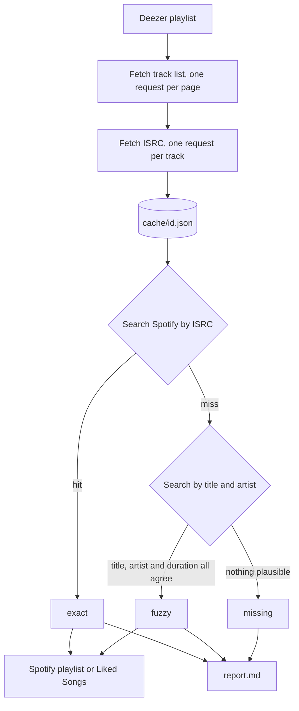

# deezer-to-spotify

[](https://github.com/inconspicuoususername/deezer-to-spotify/actions/workflows/ci.yml)
[](LICENSE)
[](https://www.python.org/downloads/)

Migrates Deezer playlists to Spotify, matching tracks by ISRC. ISRC identifies a specific recording, so you get the same master instead of a remaster, live cut, or sped-up edit that happens to share a name. Falls back to a scoped title/artist search when Deezer has no ISRC for a track.

```
=== 13232615463 ===
Resolving ISRCs: 100%|████████████████████| 381/381 [00:52<00:00, 7.23track/s]
ISRC coverage: 381/381

Searching Spotify for 381 tracks
Resolving tracks: 100%|███████████████████| 381/381 [01:14<00:00, 5.11track/s]

Matched 372/381 unique (343 exact, 29 fuzzy, 9 missing)
Report: cache/13232615463-report.md
```

## Why not Soundiiz / TuneMyMusic

They work fine, and if you have a handful of short playlists they're faster than this. Free tiers cap playlist size (Soundiiz at 200 tracks). But I had way more in my playlist than that, and didn't feel like paying them money.

## Setup

### Deezer

Deezer doesn't have new API app registration anymore, so OAuth isn't available. The public read endpoints work without a token, which means the playlist(s) you're importing must be set to public during the import. You can set it back afterwards.

Playlist ID is the last path segment of the URL:

    https://www.deezer.com/us/playlist/1234567890  ->  1234567890

### Spotify

As of February 2026 the Web API requires the developer account to have Premium. A free account is rejected at token exchange with `blocked from accessing the Web API`.

1. Create an app at https://developer.spotify.com/dashboard
2. Redirect URI, exactly: `http://127.0.0.1:8888/callback`
   (`localhost` is deprecated and will be rejected)
3. Select **Web API** when asked which APIs you'll use

Development mode is fine, since the five-user cap is irrelevant for personal use, and no endpoint here needs extended quota.

## Usage

Requires Python 3.13+ and [uv](https://docs.astral.sh/uv/).

```sh
uv sync
cp .env.example .env # then fill in the values from your Spotify app
```

```sh
# Export playlist(s) from Deezer into cache/<id>.json
uv run dts export 1234567890

# Match and import into Spotify
uv run dts import 1234567890 --dry-run
uv run dts import 1234567890

# Or both at once
uv run dts run 1234567890 9876543210

# If you wanna wipe your liked songs:
uv run dts clear_liked
```

State lives in `cache/`. The Deezer fetch checkpoints after every page, the ISRC and Spotify lookups every 50 tracks, and all of them skip entries that are already resolved, so an interrupted run resumes instead of starting over. `--refresh` forces a re-fetch from Deezer.

## How matching works



ISRCs are primarily used for matching. An ISRC is assigned per recording, so `isrc:GBAYE0601477` resolves to the one master rather than whichever of forty uploads Spotify's text search happens to rank first. This is the whole reason the export phase spends a request per track.

Fuzzy fallback is used only as a fallback when Deezer has no ISRC. A scoped `track:"..." artist:"..."` search, then each candidate has to clear three gates: title matching in either direction after Unicode normalization, at least one artist matching the same way, and duration within 8 seconds. Anything that fails all candidates is recorded as missing.

## Output

`cache/[id]-report.md` outputs fuzzy matches and songs with no Spotify equivalent. This is usually because of regional licensing gaps.

```markdown
# Favorite tracks

- Exact (ISRC): 343
- Fuzzy: 29
- Not found: 9

## Fuzzy matches, verify these

- Some Artist - Some Track  _(Some Album)_

## Couldn't find on Spotify

- Another Artist - Another Track  _(Another Album)_
```

As for the playlists themselves, order is preserved. This poses a slight issue with Liked Songs, since Spotify's API used to have a route that allowed you to impose a custom order on inserted Liked Songs, but that has since been deprecated. So you'll have to wait a second per song when importing into Liked Songs.

That ordering works out for Deezer's *Favorite tracks* specifically. The API hands them back oldest-first, the opposite of what the web player shows, and Liked Songs sorts newest-added to the top. A curated playlist has no such reversal, so you should import those into an actual Spotify playlist instead of Liked Songs, or they'll be inserted upside down.

## Limitations

- **Deezer playlists must be public** while you export them. No OAuth is available, so there's no way around this.
- **Liked Songs import will be slow.** Spotify deprecated `/me/tracks` on their API, that took `added_at` per track in favor of `/me/library`, which doesn't have a similar mechanism. This means that tracks cannot be batch inserted, but rather have to be inserted one by one in order, with a 1 second delay per insertion. You can modify the delay in [`constants.py`](/deezer_to_spotify/constants.py) and try a shorter one if you want.
- **Your Spotify developer account needs Premium.**
- **Some letters don't normalize.** Unicode NFKD only splits base-plus-accent pairs, so atomic codepoints like `ł` survive. A name spelled `Przybyłowicz` on one service and `Przybylowicz` on the other won't match on that word.
- **Resume matches on list position.** If you edit the Deezer playlist between an interrupted run and its resume, indices shift. Use `--refresh` if that happens.

## Development

```sh
uv run pytest
uv run ruff check deezer_to_spotify tests
```

## License

[AGPL-3.0-or-later](LICENSE).

## Note

This was done with the assistance of **Claude**.